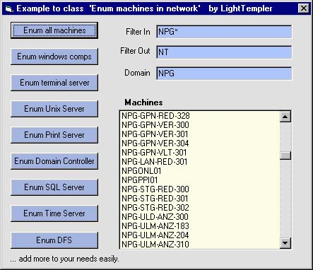



## Class for enumerating machines in net with filtering in / out

### Description

A VB class to enumerate all machines in your network. There are filters for 'take it' and 'leave it' and you can select the type of machines (e.g. Unix only, print servers only, all windows machines, ...) Its a spin-off from my daily work - nothing special, but plain, sometimes usefull und extendable ;) - If you like OOP, its for you. ___

LiTe
 
### More Info
 

             |
---                |---
**Submitted On**   |2004-09-03 10:05:08
**By**             |[Light Templer](https://github.com/Planet-Source-Code/PSCIndex/blob/master/ByAuthor/light-templer.md)
**Level**          |Advanced
**User Rating**    |5.0 (45 globes from 9 users)
**Compatibility**  |VB 5\.0, VB 6\.0
**Category**       |[Windows API Call/ Explanation](https://github.com/Planet-Source-Code/PSCIndex/blob/master/ByCategory/windows-api-call-explanation__1-39.md)
**World**          |[Visual Basic](https://github.com/Planet-Source-Code/PSCIndex/blob/master/ByWorld/visual-basic.md)
**Archive File**   |[Class\_for\_178936932004\.zip](https://github.com/Planet-Source-Code/light-templer-class-for-enumerating-machines-in-net-with-filtering-in-out__1-55993/archive/master.zip)

